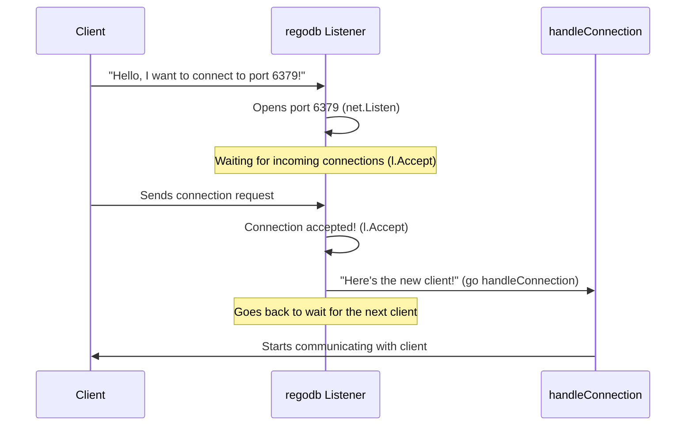

# Chapter 1: Network Listener

Welcome to the first chapter of our journey into `regodb`! We're going to explore how a server like `regodb` handles incoming requests from clients. Think of our `regodb` server as a busy restaurant, and clients (like your applications or a `redis-cli` tool) as hungry customers.

### The Problem: How Does the Server Know You Want to Talk?

Imagine a restaurant. How do new customers get inside and get served? They don't just walk into the kitchen! They need a clear entrance, and someone needs to be at that entrance to greet them.

In the world of computer servers, it's very similar. When you want to send a command to `regodb` (like "save this data!" or "give me that data!"), your computer needs a way to find `regodb` on its machine and start talking. This is where the "Network Listener" comes in!

### What is a Network Listener?

A "Network Listener" is like the friendly host or telephone operator at our `regodb` restaurant. Its job is to:

1.  **Open a specific "door"** on the server machine. This "door" is called a **port**. For Redis-compatible servers like `regodb`, this special port number is usually **6379**.
2.  **Stand by the door and listen**. It continuously waits for new "customers" (clients) to arrive and knock.
3.  **Greet new customers**. When a client tries to connect, the Listener accepts them.
4.  **Hand them over to a "waiter"**. Instead of talking to every client itself, the Listener quickly passes the new client to a dedicated "waiter" (a special helper routine) who will then handle all their requests. This way, the Listener can immediately go back to the door and wait for the *next* customer!

This process ensures that `regodb` is always available and ready to accept new connections, even if it's busy serving other clients.

### How `regodb` Uses the Network Listener

Let's look at the heart of `regodb` in the `main` function of `app/main.go` to see the Network Listener in action.

First, the server needs to "open its door" (port 6379) and be ready for visitors.

```go
// File: app/main.go

func main() {
	fmt.Println("Logs from your program will appear here!")
	l, err := net.Listen("tcp", "0.0.0.0:6379")
	if err != nil {
		fmt.Println("Failed to bind to port 6379")
		os.Exit(1)
	}
	// ... rest of the code
}
```

*   `net.Listen("tcp", "0.0.0.0:6379")`: This line is the magic!
    *   `net.Listen` is the command to start listening for network connections.
    *   `"tcp"` specifies the type of connection – "TCP" is like the standard language for internet communication.
    *   `"0.0.0.0:6379"` is the address and port.
        *   `0.0.0.0` means "listen on all available network interfaces" (basically, anyone on the network can connect if they know the server's address).
        *   `6379` is the specific port number, our "door number." If this port is already in use by another program, `regodb` won't be able to open it.

Once the door is open, the Listener needs to continuously watch for new customers.

```go
// File: app/main.go

func main() {
	// ... (previous code)

	// Accepting a connection to keep the server running
	for { // This loop keeps the Listener active forever
		conn, err := l.Accept()
		if err != nil {
			fmt.Println("Error accepting connection: ", err.Error())
			os.Exit(1)
		}
		// ... (next part)
	}
}
```

*   `for { ... }`: This is an infinite loop, meaning the Network Listener will *always* be running, waiting for new connections. It never stops!
*   `conn, err := l.Accept()`: This is the moment a "customer" (client) arrives and knocks on the door!
    *   `l.Accept()` literally means "accept the next incoming connection."
    *   It waits patiently until someone connects. When a connection happens, it creates a `conn` (short for connection), which is like the unique conversation channel with that specific client.

Finally, after accepting a new connection, the Listener quickly hands it over to a helper.

```go
// File: app/main.go

func main() {
	// ... (previous code)

	// handle commands
	go handleConnection(conn) // Handing over to a "waiter"
}
```

*   `go handleConnection(conn)`: This is where `regodb` assigns a "waiter."
    *   `handleConnection` is a separate function that knows how to talk to a client (we'll learn more about it in future chapters!).
    *   The `go` keyword is very important in Go programming. It means "start this `handleConnection` function in a *new, separate routine*." This is like telling a waiter: "You take care of this table, I'll go back to the door for new customers."
    *   Because `handleConnection` runs in a new routine, the `for` loop in `main` can immediately go back to `l.Accept()` and wait for the *next* client, without being held up by the current client's requests.

### What Happens When a Client Connects?

Let's visualize the flow of a new connection:



This sequence shows how the Network Listener efficiently handles new arrivals. It's like a concierge always ready at the entrance, quickly directing guests to their respective rooms so the entrance is never blocked.

### Summary

The Network Listener is the welcoming committee of `regodb`. It's crucial because it:

*   **Opens a specific port (6379)** for `regodb` to be found.
*   **Continuously listens** for incoming client connections.
*   **Accepts each new connection** as it arrives.
*   **Delegates the communication** to a dedicated routine (`handleConnection`) for each client, ensuring the server remains responsive and can accept many clients at once.

In the next chapter, we'll dive into what happens *after* a connection is accepted. Once the `handleConnection` routine has the client, how does it figure out what the client wants to do? That's the job of the [Command Dispatcher](02_command_dispatcher_.md)!

---
