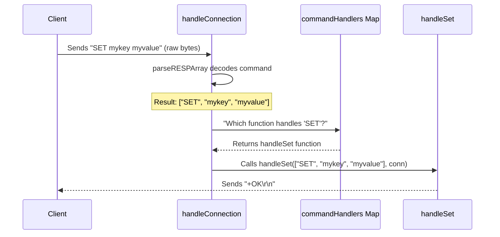

# Chapter 2: Command Dispatcher

Welcome back to `RegoDB`! In the previous chapter, [Network Listener](01_network_listener_.md), we learned how `RegoDB` opens its "door" (port 6379) and accepts new client "customers." We saw that once a connection is accepted, the Network Listener hands it over to a dedicated "waiter" routine, `handleConnection`, so it can go back to greeting new arrivals.

### The Problem: What Does the Client Want?

Now, imagine our "waiter" (`handleConnection`) is standing by a client's "table." The client is ready to order, but they don't just say "Do something!" They send specific commands like "SET mykey myvalue" (to store data) or "GET mykey" (to retrieve data).

How does our `handleConnection` waiter figure out what command the client sent and then find the *right* code to execute that specific command? It can't have one giant piece of code for *every* possible command! That would be messy and hard to manage.

This is where the **Command Dispatcher** comes in!

### What is a Command Dispatcher?

Think of the Command Dispatcher as the main control center or a very efficient receptionist for our `RegoDB` server. Once a client's "order" (command) is received and properly understood, the Command Dispatcher's job is to:

1.  **Look at the command name**: Is it "SET"? "GET"? "PING"? "ECHO"?
2.  **Find the right expert**: It then efficiently finds the specific function (an "expert chef") that is designed to execute *only* that command.
3.  **Pass the request**: It hands over the client's full request to that expert function.

This ensures that each type of command is routed to the right part of the code for processing, keeping `RegoDB` organized and fast.

### Key Components in `RegoDB`

In `RegoDB`, the Command Dispatcher's work is mainly done by two parts:

1.  The `handleConnection` function: This is our "waiter" that reads the client's request and then uses the dispatcher.
2.  The `commandHandlers` map: This is like the dispatcher's " Rolodex" or "phone book," containing a list of all known commands and which specific function handles each one.

Let's look at how they work together.

### The `handleConnection` Function: Our Busy Waiter

The `handleConnection` function is responsible for continuously listening to a specific client and processing their commands one by one.

Inside `handleConnection`, the first thing it does (which we'll cover more deeply in the [RESP Protocol Handlers](03_resp_protocol_handlers_.md) chapter) is to read the raw data sent by the client and turn it into something readable, like a list of strings: `["SET", "mykey", "myvalue"]`.

Once it has this readable command, it uses the `commandHandlers` map to find the correct function.

Here's a simplified look at the core of `handleConnection`:

```go
// File: app/main.go

func handleConnection(conn net.Conn) {
	defer conn.Close() // Ensure connection is closed when done
	reader := bufio.NewReader(conn) // Helps read from the client

	for { // Keep processing commands for this client
		args, err := parseRESPArray(reader) // Step 1: Understand the client's request
		if err != nil {
			// ... error handling and exit ...
			return
		}

		command := strings.ToUpper(args[0]) // Step 2: Get the command name (e.g., "SET")
		handler, exists := commandHandlers[command] // Step 3: Find the right function!

		if exists {
			handler(args, conn) // Step 4: Call the specific command function
		} else {
			writeError(conn, fmt.Sprintf("unknown command '%s'", command))
		}
	}
}
```

*   `for { ... }`: This infinite loop means `handleConnection` will keep listening and processing commands from this *single* client until the client disconnects or an error occurs.
*   `args, err := parseRESPArray(reader)`: This is where the magic of decoding the client's "gibberish" into meaningful `args` (arguments) happens. For example, `["SET", "mykey", "myvalue"]`. We'll explore this in the next chapter.
*   `command := strings.ToUpper(args[0])`: The first item in the `args` list is always the command name (e.g., "SET", "GET", "PING"). We convert it to uppercase just in case the client sends "set" or "Set".
*   `handler, exists := commandHandlers[command]`: This is the *heart* of the dispatcher! It looks up the command name in our `commandHandlers` map.
    *   `handler` will be the specific function (like `handleSet` or `handleGet`).
    *   `exists` tells us if we actually found a function for that command.
*   `if exists { handler(args, conn) }`: If we found a handler, we call that specific function, passing it all the `args` and the client `conn`ection. This is where the command finally gets executed!

### The `commandHandlers` Map: The Dispatcher's Phone Book

The `commandHandlers` map is a crucial part of the Command Dispatcher. It's like a dictionary or phone book where each "word" (key) is a command name, and its "definition" (value) is the specific Go function that knows how to handle that command.

```go
// File: app/main.go

// CommandHandler defines the signature for all command handler functions
type CommandHandler func(args []string, conn net.Conn)

// Map of command names to their handler functions
var commandHandlers = map[string]CommandHandler{
	"PING":   handlePing,
	"ECHO":   handleEcho,
	"SET":    handleSet,
	"GET":    handleGet,
	"RPUSH":  handleRPush,
	"LRANGE": handleLRange,
}
```

*   `type CommandHandler func(args []string, conn net.Conn)`: This line defines a "type" called `CommandHandler`. It basically says, "Any function that takes a list of strings (`args`) and a network connection (`conn`) is a `CommandHandler`." This helps keep all our command-handling functions consistent.
*   `var commandHandlers = map[string]CommandHandler{...}`: This declares our map.
    *   The `map[string]CommandHandler` part means: the "keys" (command names) are `string`s, and the "values" (the functions that handle them) are of type `CommandHandler`.
    *   `"PING": handlePing`: This entry means when the dispatcher sees the command "PING", it knows to call the `handlePing` function.
    *   Similarly, "SET" maps to `handleSet`, "GET" maps to `handleGet`, and so on. These are our "expert chef" functions, which we'll cover in the [Specific Command Implementations](04_specific_command_implementations_.md) chapter.

### How a Command is Dispatched: Step-by-Step

Let's trace what happens when a client sends a `SET` command, like `SET mykey myvalue`:

1.  **Client Connects**: The [Network Listener](01_network_listener_.md) accepts the connection and starts a new `handleConnection` routine for this client.
2.  **Client Sends Command**: The client sends the raw bytes for `SET mykey myvalue`.
3.  **Command Decoded**: Inside `handleConnection`, the `parseRESPArray` function (part of [RESP Protocol Handlers](03_resp_protocol_handlers_.md)) reads these bytes and turns them into a clean Go slice of strings: `["SET", "mykey", "myvalue"]`.
4.  **Command Name Extracted**: `handleConnection` takes the first element, `args[0]`, which is "SET".
5.  **Dispatcher Lookup**: `handleConnection` uses "SET" to look up the correct function in the `commandHandlers` map. It finds `handleSet`.
6.  **Function Called**: `handleConnection` then calls the `handleSet` function, passing it the full `["SET", "mykey", "myvalue"]` list and the client's connection.
7.  **Command Executed**: The `handleSet` function (an example of a [Specific Command Implementations](04_specific_command_implementations_.md)) does the actual work of storing "myvalue" under "mykey" in our [Data Store](05_data_store_.md).
8.  **Response Sent**: `handleSet` sends a simple `+OK\r\n` back to the client.

Here's a visual flow:



### Summary

The Command Dispatcher is a vital part of `RegoDB`. It acts as the server's central routing system, ensuring that every command received from a client is quickly and correctly directed to the specific code designed to handle it. This makes `RegoDB` organized, efficient, and easy to extend with new commands.

In the next chapter, [RESP Protocol Handlers](03_resp_protocol_handlers_.md), we'll dive deeper into how `RegoDB` actually *understands* the commands sent by clients, transforming raw bytes into the structured lists of arguments that the Command Dispatcher can work with.

---
