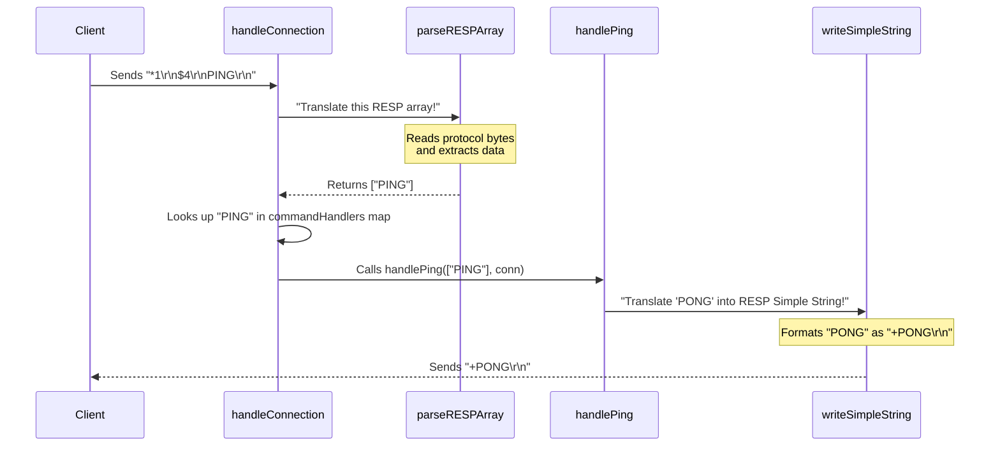

# Chapter 3: RESP Protocol Handlers

Welcome back to `RegoDB`! In the previous chapter, [Command Dispatcher](02_command_dispatcher_.md), we learned how our server, after accepting a client connection, efficiently directs incoming commands (like "SET" or "GET") to the right "expert" function for execution. But we briefly mentioned a crucial step that happens *before* the Command Dispatcher can do its job: understanding what the client is even saying!

### The Problem: Speaking the Same Language

Imagine you're visiting a foreign country. You know what you want to order at a restaurant (like a "SET" command for food), but if you and the waiter speak different languages, you won't get anywhere! The waiter needs to understand your order, and you need to understand their "OK, coming right up!" reply.

In the world of `RegoDB`, it's exactly the same. Clients (like `redis-cli`) and the `RegoDB` server don't just send plain text back and forth. They communicate using a specific, structured language called **RESP (REdis Serialization Protocol)**.

So, the problem is:
*   How does `RegoDB` understand the RESP-formatted commands sent by a client (like `*2\r\n$3\r\nSET\r\n$5\r\nmykey\r\n`) and turn them into something usable, like a list of words `["SET", "mykey", "myvalue"]`?
*   How does `RegoDB` then turn its responses (like "OK" or "myvalue") back into RESP format (`+OK\r\n` or `$7\r\nmyvalue\r\n`) before sending them back to the client?

This is where **RESP Protocol Handlers** come in!

### What are RESP Protocol Handlers?

Think of RESP Protocol Handlers as the server's **universal translators**. They are a set of functions whose sole purpose is to convert data between `RegoDB`'s internal understanding (Go strings, numbers, etc.) and the RESP language that clients speak.

They have two main jobs:

1.  **Translating IN (Parsing)**: They read raw, incoming RESP data from the client and convert it into structured Go data (like a `[]string` slice) that the [Command Dispatcher](02_command_dispatcher_.md) can easily work with. The main function for this is `parseRESPArray`.
2.  **Translating OUT (Serializing)**: They take `RegoDB`'s internal data (like the string "PONG" or an error message) and format it correctly into RESP to send back to the client. Examples include `writeSimpleString`, `writeBulkString`, `writeError`, and `writeArray`.

This translation is vital for the client and server to communicate effectively.

### Translating IN: Understanding Client Commands (`parseRESPArray`)

When a client sends a command, it's not just "SET mykey myvalue". It's sent in RESP's "array" format. Let's look at the "PING" command as an example. When you type `PING` in `redis-cli`, the client actually sends this over the network:

```
*1\r\n
$4\r\n
PING\r\n
```

Let's break down what these characters mean:
*   `*`: This means "the data coming is an array".
*   `1`: This is the number of items (arguments) in the array.
*   `\r\n`: This is the "Carriage Return Line Feed" (like pressing Enter) which marks the end of a line.
*   `$`: This means "the next item is a bulk string".
*   `4`: This is the length of the bulk string (4 characters for "PING").
*   `PING`: This is the actual string data.
*   `\r\n`: End of the bulk string.

The `parseRESPArray` function in `RegoDB` is responsible for reading these lines, one by one, and making sense of them. It turns the above raw bytes into a Go `[]string` slice like `["PING"]`.

Here's a simplified look at how `parseRESPArray` works:

```go
// File: app/main.go

func parseRESPArray(reader *bufio.Reader) ([]string, error) {
	// 1. Read the first line: e.g., "*1\r\n"
	line, err := reader.ReadString('\n')
	// ... error handling ...

	// Check if it starts with '*' and get the count (e.g., 1)
	argCount, err := strconv.Atoi(line[1:])
	// ... error handling ...

	// 2. Prepare to read arguments
	args := make([]string, 0, argCount)

	// 3. Loop through each argument
	for i := 0; i < argCount; i++ {
		// Read the string length line: e.g., "$4\r\n"
		lenLine, err := reader.ReadString('\n')
		// ... error handling ...

		// Get the length (e.g., 4)
		strLen, err := strconv.Atoi(strings.TrimSpace(lenLine[1:]))
		// ... error handling ...

		// Read the actual string data: e.g., "PING\r\n"
		buf := make([]byte, strLen+2) // +2 for \r\n
		_, err = reader.Read(buf)
		// ... error handling ...

		// Add the extracted string ("PING") to our list
		args = append(args, string(buf[:strLen]))
	}

	return args, nil // Returns ["PING"]
}
```

This function meticulously reads the protocol, ensuring each part (array header, string lengths, and string data) is processed correctly. If anything doesn't match the RESP rules, it returns an error.

### Translating OUT: Responding to Clients (`write...` functions)

After a command is processed by a specific handler (like `handlePing` or `handleSet`), `RegoDB` needs to send a reply back to the client. This reply must *also* be in RESP format. RESP defines several types of replies:

| RESP Type      | Prefix | Description                                     | Example (Go to RESP) |
| :------------- | :----- | :---------------------------------------------- | :------------------- |
| Simple String  | `+`    | Short, non-binary strings (like "OK", "PONG")   | `"OK"` -> `+OK\r\n`  |
| Errors         | `-`    | Error messages                                  | `"ERR"` -> `-ERR \r\n` |
| Integers       | `:`    | Numbers                                         | `100` -> `:100\r\n`  |
| Bulk String    | `$`    | A single binary-safe string (e.g., a data value)| `"hello"` -> `$5\r\nhello\r\n` |
| Null Bulk String | `$-1` | Represents a non-existent value                 | `nil` -> `$-1\r\n`   |
| Arrays         | `*`    | A list of other RESP types                      | `["a", "b"]` -> `*2\r\n$1\r\na\r\n$1\r\nb\r\n` |

`RegoDB` has a dedicated function for each of these common response types, making it easy for command handlers to send back the correct reply.

Here are examples of some of these `write...` functions:

```go
// File: app/main.go

// Writes a RESP Simple String like "+PONG\r\n"
func writeSimpleString(conn net.Conn, str string) error {
	_, err := conn.Write([]byte("+" + str + "\r\n"))
	return err
}

// Writes a RESP Bulk String like "$5\r\nhello\r\n"
func writeBulkString(conn net.Conn, str string) error {
	response := fmt.Sprintf("$%d\r\n%s\r\n", len(str), str)
	_, err := conn.Write([]byte(response))
	return err
}

// Writes a RESP Error like "-ERR unknown command\r\n"
func writeError(conn net.Conn, msg string) error {
	_, err := conn.Write([]byte("-ERR " + msg + "\r\n"))
	return err
}

// Writes a RESP Array of bulk strings like "*2\r\n$1\r\na\r\n$1\r\nb\r\n"
func writeArray(conn net.Conn, elems []string) error {
	out := fmt.Sprintf("*%d\r\n", len(elems)) // Start with array header
	for _, e := range elems {
		// Append each element as a bulk string
		out += fmt.Sprintf("$%d\r\n%s\r\n", len(e), e)
	}
	_, err := conn.Write([]byte(out))
	return err
}
```

These functions take regular Go data (strings, slices) and automatically format them into the byte sequences required by the RESP protocol, ready to be sent over the network to the client.

### How `RegoDB` Uses RESP Protocol Handlers

Let's revisit our "PING" command example and see how both sides of the translation work together in `RegoDB`'s `handleConnection` function:

1.  **Client sends raw RESP**: The client sends `*1\r\n$4\r\nPING\r\n` to `RegoDB`.
2.  **`handleConnection` receives**: The `handleConnection` routine, our "waiter", gets these raw bytes.
3.  **`parseRESPArray` translates IN**: `handleConnection` calls `parseRESPArray` to decode the raw bytes.
    ```go
    // File: app/main.go
    // Inside handleConnection:
    args, err := parseRESPArray(reader) // Reads raw bytes, returns ["PING"]
    // ... error handling ...
    ```
4.  **[Command Dispatcher](02_command_dispatcher_.md) routes**: The `handleConnection` then takes `args[0]` ("PING") and uses the `commandHandlers` map to find `handlePing`.
    ```go
    // File: app/main.go
    // Inside handleConnection:
    command := strings.ToUpper(args[0]) // command is "PING"
    handler, exists := commandHandlers[command] // handler is handlePing
    handler(args, conn) // Calls handlePing(["PING"], conn)
    ```
5.  **`handlePing` translates OUT**: The `handlePing` function, knowing it needs to reply with "PONG", calls `writeSimpleString`.
    ```go
    // File: app/main.go
    // Inside handlePing:
    func handlePing(args []string, conn net.Conn) {
        writeSimpleString(conn, "PONG") // Sends "+PONG\r\n" to client
    }
    ```
6.  **Client receives raw RESP**: The client receives `+PONG\r\n` and understands it as the "PONG" reply.

Here's the full flow:



### Summary

RESP Protocol Handlers are the essential communication bridge in `RegoDB`. They allow the server to:

*   **Understand client commands** by parsing raw RESP bytes into structured data that `RegoDB`'s internal logic can process.
*   **Speak back to clients** by converting `RegoDB`'s internal data into the correct RESP format expected by clients.

Without these "universal translators," `RegoDB` and its clients would be speaking entirely different languages, making communication impossible. They are a fundamental part of making `RegoDB` compatible with the Redis protocol.

In the next chapter, [Specific Command Implementations](04_specific_command_implementations_.md), we will finally dive into the "expert chef" functions themselves (like `handleSet` and `handleGet`) and see how they use the data provided by `parseRESPArray` and send back replies using the `write...` functions.

---
