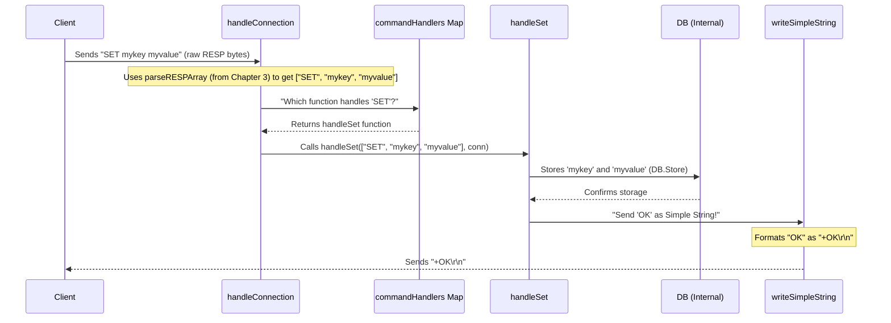

# Chapter 4: Specific Command Implementations

Welcome back to `RegoDB`! In the previous chapter, [RESP Protocol Handlers](03_resp_protocol_handlers_.md), we learned how `RegoDB` acts as a brilliant "universal translator," making sure both the server and clients speak the same language (RESP). We saw how raw client commands are `parseRESPArray`-ed into neat lists of arguments, and how `RegoDB`'s replies are `write...` back into RESP format.

Now, we know *how* `RegoDB` understands commands, and the [Command Dispatcher](02_command_dispatcher_.md) knows *where* to send them (to the right "expert" function). But what do these "expert" functions *actually do*?

### The Problem: Performing the Actual Task

Imagine our `RegoDB` restaurant again. The Network Listener is the host, the [Command Dispatcher](02_command_dispatcher_.md) is the receptionist, and the [RESP Protocol Handlers](03_resp_protocol_handlers_.md) are the translators. They've all done their job: a new customer has arrived, placed an order (like "SET mykey myvalue"), and the order has been clearly translated and routed to the right specialist.

But who *cooks* the food? Who *prepares* the drink? It's not the host, the receptionist, or the translator! It's the **specialized workers** in the kitchen or behind the bar.

In `RegoDB`, these specialized workers are the **Specific Command Implementations**. They are the functions that actually *perform* the requested task.

### What are Specific Command Implementations?

These are the dedicated functions for each type of command `RegoDB` supports. Think of them as individual "expert chefs" in our `RegoDB` kitchen.

Each specific command implementation function has a simple but crucial job:

1.  **Receive the parsed command**: They get the list of arguments (like `["SET", "mykey", "myvalue"]`) that the [RESP Protocol Handlers](03_resp_protocol_handlers_.md) prepared and the [Command Dispatcher](02_command_dispatcher_.md) routed.
2.  **Perform the designated task**: They know exactly how to carry out their specific operation, whether it's storing a value (`SET`), retrieving one (`GET`), adding to a list (`RPUSH`), or simply responding with "PONG" (`PING`).
3.  **Interact with the Data Store**: Often, these functions will need to talk to the place where `RegoDB` keeps all its information – the [Data Store](05_data_store_.md) (which we'll explore in the next chapter!).
4.  **Send back results**: They use the [RESP Protocol Handlers](03_resp_protocol_handlers_.md) (like `writeSimpleString` or `writeBulkString`) to send the appropriate response back to the client.

### How `RegoDB` Uses Specific Command Implementations

Let's look at some examples of these "expert chef" functions in `RegoDB`'s `app/main.go` file. Remember, these functions are called by the `handleConnection` routine after the [Command Dispatcher](02_command_dispatcher_.md) has identified which command was sent.

#### 1. The `PING` Command (`handlePing`)

This is the simplest command. When a client sends "PING", `RegoDB` just needs to reply "PONG".

```go
// File: app/main.go

// Command handlers
func handlePing(args []string, conn net.Conn) {
	// We use a RESP Protocol Handler to send back a simple string
	writeSimpleString(conn, "PONG")
}
```

*   `func handlePing(args []string, conn net.Conn)`: This is our `handlePing` function. It receives `args` (which for PING would just be `["PING"]`) and the `conn`ection to the client.
*   `writeSimpleString(conn, "PONG")`: This line uses one of our [RESP Protocol Handlers](03_resp_protocol_handlers_.md) to format and send the "PONG" reply. The client will receive `+PONG\r\n`.

#### 2. The `ECHO` Command (`handleEcho`)

The `ECHO` command simply sends back whatever argument it receives.

```go
// File: app/main.go

func handleEcho(args []string, conn net.Conn) {
	if len(args) < 2 { // Check if there's an argument to echo
		writeError(conn, "wrong number of arguments for 'echo' command")
		return // Send an error if no argument
	}
	// We use a RESP Protocol Handler to send back a "bulk string"
	writeBulkString(conn, args[1]) // args[1] is the text to echo
}
```

*   `if len(args) < 2`: This is an important check! `args[0]` is always the command name ("ECHO"). `args[1]` would be the string to echo. If it's missing, we send an error using `writeError`.
*   `writeBulkString(conn, args[1])`: If valid, we use the `writeBulkString` [RESP Protocol Handler](03_resp_protocol_handlers_.md) to send back `args[1]` as a bulk string. For `ECHO hello`, the client receives `$5\r\nhello\r\n`.

#### 3. The `SET` Command (`handleSet`)

This command stores a key-value pair in `RegoDB`'s [Data Store](05_data_store_.md).

```go
// File: app/main.go

func handleSet(args []string, conn net.Conn) {
	if len(args) < 3 { // SET needs a key and a value
		writeError(conn, "wrong number of arguments for 'set' command")
		return
	}

	key := args[1]   // The first argument after "SET" is the key
	value := args[2] // The second argument is the value

	// Create a new data entry. expiresAt is for "expiration" (advanced),
	// but for now, think of it as just holding the value.
	entry := Entry{value: value, expiresAt: time.Time{}} // time.Time{} means "no expiration"

	// This is where we interact with our Data Store!
	// DB.Store is how we save data. We will dive deep into DB in Chapter 5.
	DB.Store(key, entry)

	writeSimpleString(conn, "OK") // Confirm success to the client
}
```

*   `key := args[1]`, `value := args[2]`: The `handleSet` function extracts the key and value from the `args` list.
*   `DB.Store(key, entry)`: This is the core action. It calls a function (`Store`) on our `DB` (Data Base) to save the `value` under its `key`. We'll learn all about `DB` in the next chapter, [Data Store](05_data_store_.md).
*   `writeSimpleString(conn, "OK")`: After saving, `RegoDB` sends a simple "OK" back to the client.

#### 4. The `GET` Command (`handleGet`)

This command retrieves a value associated with a given key from the [Data Store](05_data_store_.md).

```go
// File: app/main.go

func handleGet(args []string, conn net.Conn) {
	if len(args) < 2 { // GET needs a key
		writeError(conn, "wrong number of arguments for 'get' command")
		return
	}

	key := args[1] // The key we want to retrieve

	// This is where we interact with our Data Store to load data!
	value, ok := DB.Load(key) // Try to load the key from DB
	if !ok {                  // If the key doesn't exist
		writeNullBulkString(conn) // Send a special "null" response
		return
	}

	// Assuming value is an Entry struct, get its actual string value
	entry := value.(Entry) // Convert the loaded value back to our Entry type
	
	// (More advanced: Check if the key has expired)
	// if !entry.expiresAt.IsZero() && time.Now().After(entry.expiresAt) {
	//     DB.Delete(key)
	//     writeNullBulkString(conn)
	//     return
	// }

	writeBulkString(conn, entry.value) // Send the retrieved value as a bulk string
}
```

*   `key := args[1]`: Extracts the key from the command arguments.
*   `value, ok := DB.Load(key)`: This line tries to load the value from our `DB` ([Data Store](05_data_store_.md)). `ok` will be `true` if the key exists, `false` otherwise.
*   `if !ok { writeNullBulkString(conn); return }`: If the key isn't found, `RegoDB` sends a "Null Bulk String" (which `redis-cli` shows as `(nil)`).
*   `writeBulkString(conn, entry.value)`: If the key is found, its `value` is sent back as a RESP bulk string.

### The Full Journey of a `SET` Command

Let's trace how a `SET mykey myvalue` command travels through `RegoDB`, highlighting the role of the Specific Command Implementation (`handleSet`):



This sequence shows how `handleSet` (the "Worker") is specifically called to perform the task. It extracts the necessary pieces of information, interacts with the [Data Store](05_data_store_.md) to get the job done, and then uses a [RESP Protocol Handler](03_resp_protocol_handlers_.md) to communicate the result back to the client.

### Summary

Specific Command Implementations are the backbone of `RegoDB`'s functionality. They are the functions (like `handlePing`, `handleEcho`, `handleSet`, `handleGet`) that:

*   **Receive commands**: They are given the parsed arguments for the command they specialize in.
*   **Execute the core logic**: They contain the actual code to perform the operation, like storing data, retrieving it, or manipulating lists.
*   **Utilize other components**: They interact with the [Data Store](05_data_store_.md) to read and write data and use [RESP Protocol Handlers](03_resp_protocol_handlers_.md) to send formatted responses back to the client.

They are the "doers" that make `RegoDB` capable of responding to client requests with actual work, not just protocol chatter.

In the next chapter, [Data Store](05_data_store_.md), we will finally open the doors to `RegoDB`'s "storage room" and understand how the `DB.Store` and `DB.Load` functions actually save and retrieve your precious data!

---
