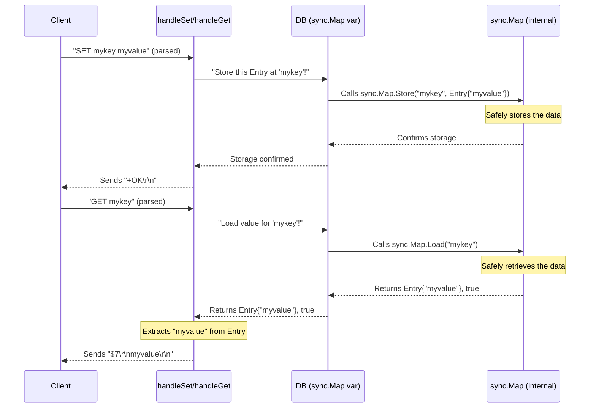

# Chapter 5: Data Store

Welcome back to `RegoDB`! In the previous chapter, [Specific Command Implementations](04_specific_command_implementations_.md), we learned about the "expert chef" functions like `handleSet` and `handleGet` that actually perform the work requested by clients. We saw how `handleSet` was responsible for storing a value, and `handleGet` for retrieving it. But there was one crucial question we left unanswered: **Where do they put the data, and where do they get it from?**

### The Problem: Where Does All Your Information Go?

Imagine `RegoDB` as a very busy office. Clients send requests to "file this document" (like `SET mykey myvalue`) or "find that document" (like `GET mykey`). The network listener is the front desk, the command dispatcher is the mailroom, and the command implementations are the clerks who handle specific tasks.

But if the clerks just write on sticky notes and put them in their pockets, or scatter them around the office, it would be a chaotic mess! You'd never find anything reliably. `RegoDB` needs a central, organized place to keep **all** the information it manages, a place that's safe, reliable, and accessible to all "clerks" at the same time.

This "central, organized place" is what we call the **Data Store**.

### What is a Data Store?

The Data Store is like `RegoDB`'s main brain or a very efficient digital cabinet. It's the core memory component where all your `RegoDB` instance's data lives. When you `SET` something, it goes into the Data Store. When you `GET` something, it's pulled from the Data Store.

It has two key responsibilities:

1.  **Storing Information**: It holds key-value pairs, where a "key" is like a label on a folder, and the "value" is the actual information inside the folder.
2.  **Safe Access**: Many clients can try to `SET` and `GET` data at the same time. The Data Store must be designed so that these simultaneous accesses don't cause problems (like two people trying to write to the same spot at once and messing up the data).

### Key Components of the Data Store

In `RegoDB`, the Data Store is built using a few simple but powerful Go concepts:

#### 1. The `DB` Variable: Our Central Cabinet

In `RegoDB`, we have a global variable named `DB`. This `DB` variable is designed to hold all our data.

```go
// File: app/main.go

// DB is our main data store, like a big cabinet for all information
var DB sync.Map
```

*   `var DB sync.Map`: This declares `DB` as a `sync.Map`. We'll explain `sync.Map` next, but for now, think of `DB` as the one big, shared digital cabinet that everyone in `RegoDB` uses.

The `DB` needs to be initialized when the server starts.

```go
// File: app/main.go

func Start() {
	// Initialize our DB cabinet when RegoDB starts
	DB = sync.Map{}
}

func main() {
    // ...
    go Start() // Start the DB as a separate routine
    // ...
}
```

*   `Start()`: This function simply creates an empty `sync.Map` and assigns it to our `DB` variable, making it ready to store data.
*   `go Start()`: In `main`, `Start()` is called to set up the `DB` when `RegoDB` begins running.

#### 2. `sync.Map`: The Magic Cabinet for Safe Sharing

A `sync.Map` is a special kind of "map" (like a dictionary or phone book) in Go. It's designed specifically for situations where many different parts of your program (like multiple `handleConnection` routines) might try to read from or write to it at the same time.

*   **Why `sync.Map`?**: Without `sync.Map` (or similar mechanisms), if two clients tried to `SET` or `GET` the same key at the exact same moment, your `RegoDB` could crash or corrupt data. `sync.Map` handles all the complex "locking" behind the scenes, ensuring that operations are safe even with many simultaneous accesses. Think of it as a magic cabinet that automatically locks the drawer when someone is using it, then unlocks it when they're done, preventing collisions.

`sync.Map` provides simple methods to interact with data:

*   `Store(key, value)`: Puts a `value` into the map associated with a `key`.
*   `Load(key)`: Retrieves the `value` associated with a `key`. It also tells you if the `key` was found (`ok` boolean).
*   `Delete(key)`: Removes a `key` and its `value` from the map.

#### 3. `Entry` and `ListEntry`: What Goes Inside the Cabinet

The `sync.Map` can store any type of Go data. To make `RegoDB` structured, we define specific "types" for the information we want to store.

```go
// File: app/main.go

// Entry represents a simple string value with an optional expiration time
type Entry struct {
	value     string    // The actual string data
	expiresAt time.Time // When this entry should expire (if any)
}

// ListEntry represents a collection of strings, like a grocery list
type ListEntry struct {
	elements  []string  // A list of strings
	expiresAt time.Time // When this list should expire (if any)
}
```

*   `Entry`: This is used for basic `SET`/`GET` commands. It holds a `value` (a `string`) and an `expiresAt` field. The `expiresAt` is for more advanced features like Redis's `EX` or `PX` (expiration time), but for now, just know it's there.
*   `ListEntry`: This is used for commands that manage lists, like `RPUSH` (add to a list) or `LRANGE` (get items from a list). It holds `elements` (a `[]string`, which is a list of strings in Go).

These `Entry` and `ListEntry` types allow `RegoDB` to store different kinds of data (simple strings, lists of strings) in an organized way.

### How `RegoDB` Uses the Data Store: `SET` and `GET`

Let's revisit `handleSet` and `handleGet` from the [Specific Command Implementations](04_specific_command_implementations_.md) chapter and see how they interact with our `DB` (the `sync.Map`) to actually store and retrieve data.

#### Storing Data with `SET` (`handleSet`)

When you run `SET mykey myvalue`, `handleSet` uses the Data Store to save "myvalue" under the key "mykey".

```go
// File: app/main.go

func handleSet(args []string, conn net.Conn) {
	// ... (argument checks omitted for brevity) ...

	key := args[1]   // "mykey"
	value := args[2] // "myvalue"

	// Create an Entry to store in our DB
	entry := Entry{value: value, expiresAt: time.Time{}} // No expiration for simplicity

	// Store the key and the Entry in our global DB cabinet
	DB.Store(key, entry) // This is where the magic happens!

	writeSimpleString(conn, "OK") // Tell the client it's done
}
```

*   `entry := Entry{value: value, expiresAt: time.Time{}}`: We first create an `Entry` object, putting the `value` from the command into its `value` field.
*   `DB.Store(key, entry)`: This is the critical line! It tells our `DB` (the `sync.Map`) to `Store` the `entry` object using `key` as its identifier. The `sync.Map` safely handles saving this data.

#### Retrieving Data with `GET` (`handleGet`)

When you run `GET mykey`, `handleGet` uses the Data Store to find and retrieve the value associated with "mykey".

```go
// File: app/main.go

func handleGet(args []string, conn net.Conn) {
	// ... (argument checks omitted for brevity) ...

	key := args[1] // "mykey"

	// Try to load the value associated with 'key' from our DB
	val, ok := DB.Load(key) // This is where the magic happens!

	if !ok { // If the key was not found
		writeNullBulkString(conn) // Send (nil) to client
		return
	}

	// The loaded 'val' is a generic interface{}, so we convert it back to our Entry type
	entry := val.(Entry)

	// (Advanced: Expiration check happens here in full code)

	writeBulkString(conn, entry.value) // Send the stored string back to client
}
```

*   `val, ok := DB.Load(key)`: This line tells our `DB` to `Load` the item identified by `key`.
    *   `val` will be the `Entry` we stored (or `nil` if not found).
    *   `ok` will be `true` if the key exists, `false` otherwise.
*   `if !ok`: If `ok` is `false`, it means the key wasn't found, so we send a special "null" response.
*   `entry := val.(Entry)`: Since `DB.Load` returns a generic `interface{}`, we have to tell Go that we expect it to be an `Entry` struct. This is called a "type assertion."
*   `writeBulkString(conn, entry.value)`: Finally, we extract the `value` from the `Entry` and send it back to the client.

### How the Data Store Works Under the Hood

Let's visualize the `SET` and `GET` operations:



This diagram shows that the `DB` variable acts as the entry point to the `sync.Map`, which then does the actual work of safely storing and retrieving the `Entry` or `ListEntry` objects.

### Summary

The Data Store is the core memory of `RegoDB`. It's where all the information is persistently kept and managed.

*   It uses a global `DB` variable, which is a `sync.Map`, to hold all key-value pairs.
*   `sync.Map` ensures that multiple clients can access and modify data safely at the same time without conflicts.
*   Data is stored as `Entry` structs (for simple strings) or `ListEntry` structs (for collections of strings), allowing `RegoDB` to support different data types.
*   [Specific Command Implementations](04_specific_command_implementations_.md) like `handleSet` and `handleGet` directly interact with the `DB.Store` and `DB.Load` methods to perform their tasks.

The Data Store is fundamental because it's the heart where all your `RegoDB` instance's data resides and is managed, making `RegoDB` a functional and reliable data server!

---
