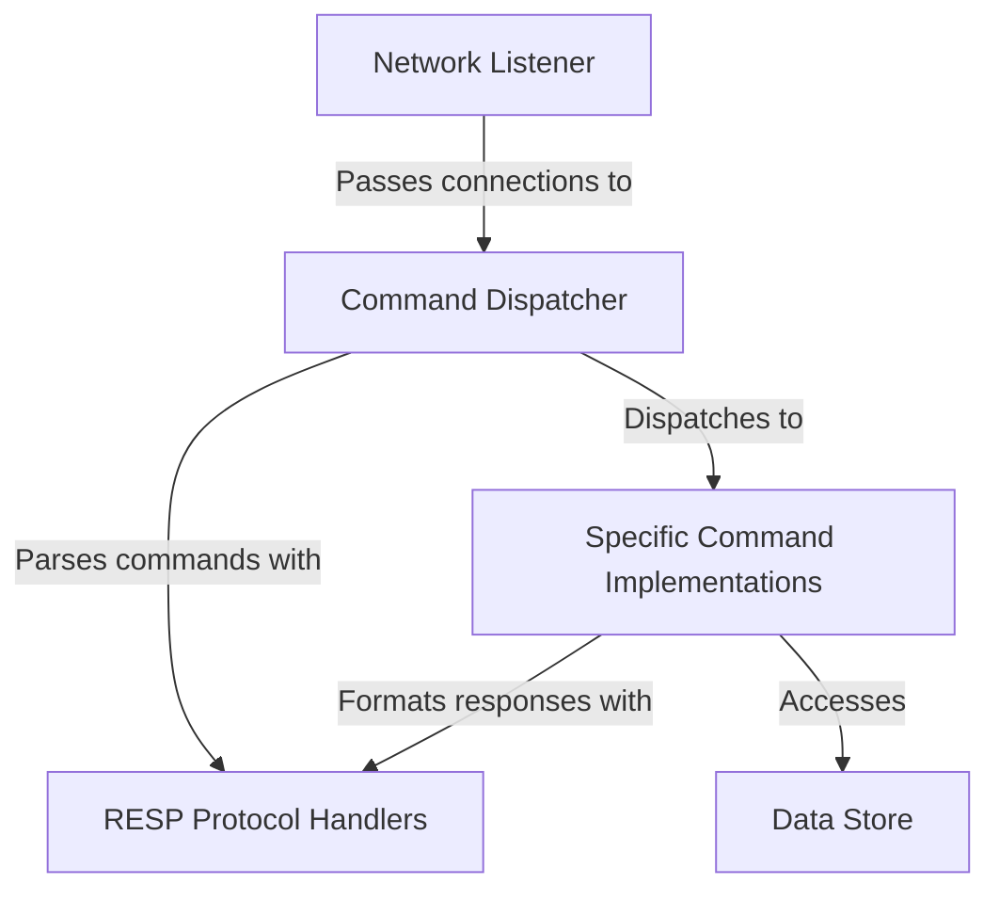

# Overview: RegoDB

RegoDB is a simple, **in-memory database** server that mimics some functionalities of Redis. It acts like a digital librarian, listening for client requests, understanding a special language called *RESP*, and then efficiently performing operations like *storing* (**SET**), *retrieving* (**GET**), or *managing lists* (**RPUSH**, **LRANGE**) of data, all while keeping everything safely organized in its main memory.

## Visual Overview

## Chapters

1. [Network Listener
](01_network_listener_.md)
2. [Command Dispatcher
](02_command_dispatcher_.md)

---
